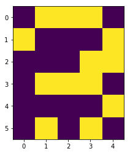

# Binarny model pamięci skojarzeniowej
pamięć dwukierunkowa


```python
import numpy as np
from matplotlib import pyplot as plt
```


```python
# wzorce do nauki
i0,n0 = np.array([0,1,1,1,0,
		  1,0,0,0,1,
		  1,0,0,0,1,
		  1,0,0,0,1,
		  1,0,0,0,1,
		  0,1,1,1,0]),np.array([1,0,0,0])

i1,n1 = np.array([0,0,0,0,1,
		  0,0,0,1,1,
		  0,0,1,0,1,
		  0,0,0,0,1,
		  0,0,0,0,1,
		  0,0,0,0,1]),np.array([0,1,0,0])

i2,n2 = np.array([0,1,1,1,0,
		  1,0,0,0,1,
		  0,0,0,1,0,
		  0,0,1,0,0,
		  0,1,0,0,0,
		  1,1,1,1,1]),np.array([0,0,1,0])

i3,n3 = np.array([0,1,1,1,0,
		  1,0,0,0,1,
		  0,0,0,0,1,
		  0,0,1,1,0,
		  1,0,0,0,1,
		  0,1,1,1,0]),np.array([0,0,0,1])

# wzorce do testowania

ti0,tn0 = np.array([0,1,1,0,0,
		    1,0,0,0,1,
		    1,0,0,0,1,
		    1,0,0,0,1,
		    1,0,1,0,1,
		    0,1,0,1,0]),np.array([1,0,0,0])

ti1,tn1 = np.array([0,0,0,0,1,
		    0,0,0,1,1,
		    0,0,1,1,0,
		    0,1,0,0,1,
		    0,0,0,0,1,
		    0,0,0,0,1]),np.array([0,1,0,0])

ti2,tn2 = np.array([0,1,0,1,0,
		    1,0,1,0,1,
		    0,0,0,1,0,
		    0,0,0,0,0,
		    0,1,0,1,0,
		    1,1,1,1,1]),np.array([0,0,1,0])

ti3,tn3 = np.array([0,1,1,1,0,
		    1,0,0,0,1,
		    0,0,0,1,1,
		    0,1,1,1,0,
		    0,0,0,0,1,
		    0,1,0,1,0]),np.array([0,0,0,1])
```


```python
# klasa modelu

class BAM():
	def __init__(self,h,w):
		self.M = np.zeros((h,w))
	
	def fit(self,image,name):
		for i in xrange(len(image)):
			for j in xrange(len(name)):
				if image[i] ^ name[j]:
					self.M[i][j] -= 1
				else:
					self.M[i][j] += 1

	def activ(self,z,t):
		return np.where(z>0,1,0)

	def ItoN(self,image,t=0):
		return self.activ( np.matrix(image) * np.matrix(self.M), t )
	
	def NtoI(self,name,t=0):
		print np.matrix(self.M).shape
		print np.matrix(name).T.shape
		return self.activ( np.matrix(self.M) * np.matrix(name).T, t )

# tworzenie modelu

C = BAM(len(i2),len(n2))

# tworzenie wieimage[i] ^ name[j]:lomianu korelacji ( uczenie modelu )

C.fit(i0,n0)
C.fit(i1,n1)
C.fit(i2,n2)
C.fit(i3,n3)
```


```python
# ti0, ti1, ti2, ti3
num = ti3

a = num.reshape(6,5)
plt.imshow(a)
plt.show()

c = C.ItoN(num)
for i,t in enumerate(c[0]):
    if t==1:
        print "To jest",i
```





    To jest 3
    
