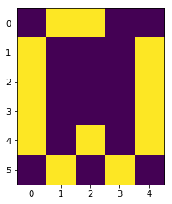
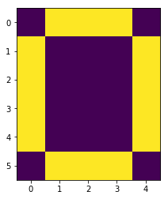
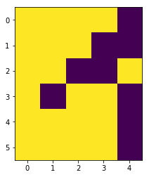
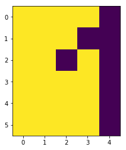
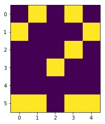
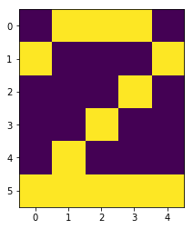

# Sieć Hopfilda która modyfikuje wzorzec do najbardziej podobnego który widział przy nauce.


```python
import numpy as np
import matplotlib.pyplot as plt
import copy
```


```python
class HopfildNetwork():
    def __init__(self,size):
        self.W = np.zeros((size,size))
        self.teta = np.zeros(size)

    def sign(self,activation, M):
        return np.where(activation>0,1,np.where(activation<0,-1,M))  
    
    def train(self,M):
        l = len(M)
        for i in xrange(l):
            for j in xrange(l):
                if i != j:
                    self.W[i][j] += M[i]*M[j]        
        #print self.W
        
    def show(self,X):
        per =range(len(X))  
        np.random.shuffle(per)
        l = len(X)
        z = copy.copy(X)
        wall = True
        
        while (wall):
            wall = False
            for i in per:
                spin = 0
                for j in xrange(l):
                    spin += self.W[i][j]*X[j] - self.teta[i]
                spin = self.sign(spin,X[i])

                if z[i] != spin:
                    z[i] = spin
                    wall = True
        return z
```


```python
a = np.array([-1,1,1,1,-1,
              1,-1,-1,-1,1,
              1,-1,-1,-1,1,
              1,-1,-1,-1,1,
              1,-1,-1,-1,1,
              -1,1,1,1,-1])

b = np.array([-1,-1,-1,-1,1,
              -1,-1,-1,1,1,
              -1,-1,1,-1,1,
              -1,-1,-1,-1,1,
              -1,-1,-1,-1,1,
              -1,-1,-1,-1,1])

c = np.array([-1,1,1,1,-1,
              1,-1,-1,-1,1,
              -1,-1,-1,1,-1,
              -1,-1,1,-1,-1,
              -1,1,-1,-1,-1,
              1,1,1,1,1])


ai = np.array([-1,1,1,-1,-1,
                1,-1,-1,-1,1,
                1,-1,-1,-1,1,
                1,-1,-1,-1,1,
                1,-1,1,-1,1,
                -1,1,-1,1,-1])

bi = np.array([-1,-1,-1,-1,1,
                -1,-1,-1,1,1,
                -1,-1,1,1,-1,
                -1,1,-1,-1,1,
                -1,-1,-1,-1,1,
                -1,-1,-1,-1,1])

ci = np.array([-1,1,-1,1,-1,
              1,-1,-1,-1,1,
              -1,-1,-1,1,-1,
              -1,-1,1,-1,-1,
              -1,-1,-1,-1,-1,
              1,1,-1,1,1])
```


```python
hop = HopfildNetwork(len(a))
hop.train(a)
hop.train(b)
hop.train(c)
```


```python
for i in [ai,bi*(-1),ci]:
    M = i
    plt.imshow(M.reshape(6,5))
    plt.show()
    M = hop.show(M)
    plt.imshow(M.reshape(6,5))
    plt.show()
```



















