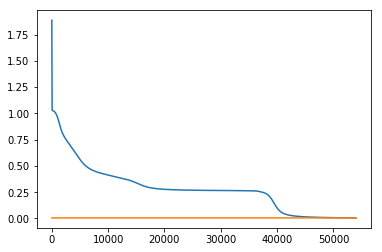

# Moje pierwsze MLP które rozwiązuje problem XOR-a.


```python
import numpy as np
from pandas import read_table
from math import exp
import matplotlib.pylab as plt
```


```python
XOR=read_table('http://www.is.umk.pl/~kdobosz/nn/data/xor_ext.txt',index_col=None, header=None).values
X,y = XOR[:,[0,1]], XOR[:,[2]]
print X,y
```

    [[-1 -1]
     [-1  1]
     [ 1 -1]
     [ 1  1]
     [-2 -2]
     [-2  2]
     [ 2 -2]
     [ 2  2]] [[-1]
     [ 1]
     [ 1]
     [-1]
     [ 1]
     [-1]
     [-1]
     [ 1]]
    


```python
X=X/2.+1
y=y/2.+.5
print X,y
```

    [[0.5 0.5]
     [0.5 1.5]
     [1.5 0.5]
     [1.5 1.5]
     [0.  0. ]
     [0.  2. ]
     [2.  0. ]
     [2.  2. ]] [[0.]
     [1.]
     [1.]
     [0.]
     [1.]
     [0.]
     [0.]
     [1.]]
    


```python
class MLP(): 
 
    def sygmoida(self,x):
        return 1.0/(1.0 + exp(-x))
    
    
    def rsygmoida(self,x): 
        return x * (1.0 - x)
 
    def __init__(self, eta=.1, epoch=1, size=(2,1), ok=.005):
        self.eta = eta 
        self.epoch = epoch
        self.size = size
        self.LW = len(self.size)
        self.ok = ok
    
    
    def predict(self, xi):
        self.O = [xi]
        self.I = []
        for i in xrange(self.LW):
            self.I.append([])
            self.O.append([])
            for j in xrange(self.size[i]):
                self.I[i].append(( np.dot(self.O[i], self.w_[i][j][1:]) + self.w_[i][j][0] ))
                self.O[i+1].append(self.sygmoida(self.I[i][j]))
        return self.O[-1]
  
  
    def train(self,X,y):
        self.w_ = []
        
        # losowanie wag i biasow
        for i in xrange(len(self.size)): 
            self.w_.append([]) 
            for j in xrange(self.size[i]): 
                if i != 0: 
                    self.w_[i].append(np.random.random(self.size[i - 1] + 1)) 
                else: 
                    self.w_[i].append(np.random.random(X.shape[1] + 1))
        
        # wsteczna propragacja 
        self.eerr = []
        
        self.ile_epok = 0
        
        for _ in xrange(self.epoch):
            self.ile_epok += 1
            np.random.shuffle(zip(X,y))
            err = 0
            for xi, yi in zip(X,y):
                o = self.predict(xi) 
        
                # liczenie delty 
                self.delta = [[]] 
                 
                # warstwa wyjsciowa 
                for j in xrange(self.size[-1]): 
                    self.delta[0].append((yi[j] - o[j])  * self.rsygmoida(o[j]))
                
                # warstwa/y ukryta 
                for i in xrange(self.LW-1):
                    self.delta.append([])
                    for j in xrange(self.size[self.LW-2-i]):
                        suma = 0
                        for k in xrange(self.size[self.LW-1-i]):
                            suma += self.delta[i][k] * self.w_[self.LW-1-i][k][j+1]
                        self.delta[i+1].append( self.rsygmoida(self.O[self.LW-1-i][j]) * suma)               
                self.delta.reverse()

                # poprawa wag
                
                for i in xrange(self.LW):
                    for j in xrange(self.size[i]):
                        for k in xrange(len(self.O[i])+1):
                            if k != 0:
                                new_w = self.w_[i][j][k] + self.eta * self.delta[i][j] * self.O[i][k-1]
                            else:
                                new_w = self.w_[i][j][k] + self.eta * self.delta[i][j]
                                
                            self.w_[i][j][k] = new_w
                            
                # liczenie błedu dla epoki
                for j in xrange(self.size[-1]):
                    err += (yi[j]-self.O[-1][j]) ** 2/2
            self.eerr.append(err)
            if err < self.ok:
                break
        print "Zatrzymane na: ", self.ile_epok
```


```python
m = MLP(epoch=70000,size=(6,len(y[0])))
m.train(X,y)
```

    Zatrzymane na:  54045
    


```python
plt.plot(range(m.ile_epok),m.eerr)
plt.plot(range(m.ile_epok),np.ones(m.ile_epok)*m.ok)
plt.show()
```





```python
for i in xrange(X.shape[0]): 
    print m.predict(X[i]), y[i]
```

    [0.013647769354221524] [0.]
    [0.9589908896510404] [1.]
    [0.9644408890609745] [1.]
    [0.06549747760696352] [0.]
    [0.9990840844626087] [1.]
    [0.016312172382013112] [0.]
    [0.013016587781570516] [0.]
    [0.954244796606391] [1.]
    
