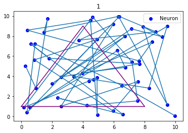
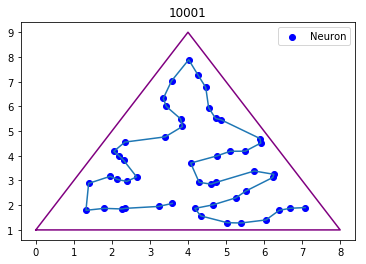
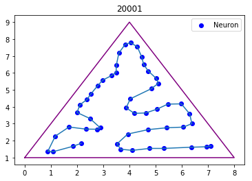
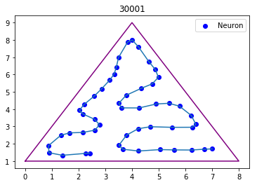
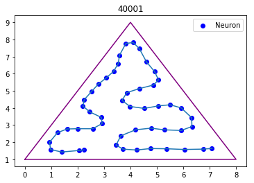
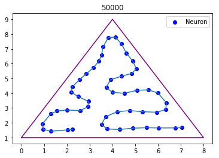

# (Samoorganizująca się mapa) Self-Organized Map 


```python
import numpy as np
import matplotlib.pyplot as plt
```


```python
class SOM():
    def __init__(self, n_tab, n_iner, range=5 ,show=10, p=([0,1],[4,9],[8,1]),  mi=1):
        """
        :param n_tab: Ilosc neuronow
        :param n_iner: Ilosc iteracji
        :param range: Poczatkowa ilosc przesuwanych sasiadow zwycieskiego  neuronu
        :param show: Co ile epok ma pokazywac wykres
        :param p: Punkty krojkata w postaci ([a,b],[c,d],[e,f])
        :param mi: Poczatkowy wspolczynnik przesuniecia 
        """
        self.tab = np.random.rand(n_tab,2)*10 
        self.n_iner = n_iner
        self.mi = mi
        self.range = range
        self.p = p
        self.show = show
        
    def train(self):
        
        n_show = int((self.n_iner+1) / self.show)
        n_change = int((self.n_iner+1) / 50)

        for itr in xrange(self.n_iner):
            
            # zmiejszanie self.mi oraz self.range
            # i to wszystko bedzie
            if (itr%n_change==0):
                self.mi *= .9

            rand = self.randomIn()
            idx = self.pitagoras(rand)
            
            for i in xrange(self.range*2+1):

                a = idx - self.range +i 
                if (a<0 or a>len(self.tab)-1):
                    continue
                delx = (self.tab[a][0] - rand[0][0]) * self.mi
                dely = (self.tab[a][1] - rand[0][1]) * self.mi
                
                self.tab[a][0] -= delx
                self.tab[a][1] -= dely
            if n_show == 0:
                self.draw(rand,idx,itr)
            elif itr%n_show==0:
                self.draw(rand,idx,itr)
        self.draw(rand,idx,itr)
            
    def randomIn(self):
        """
        Dziala tylko dla niektorych trojkatow 
        Bez zmiany figury wszystko dziala, jesli bedzie potrzeba dodac mozwilosc zmiany figury wzorcowej
        :return: r - liczba losowa zawarta w figurze 
        """
        s = []
        
        a = (self.p[0][1]- self.p[1][1])/(self.p[0][0]- self.p[1][0])
        b = self.p[1][1] - a * self.p[1][0]
        s.append([a,b])
        
        a = (self.p[0][1]- self.p[2][1])/(self.p[0][0]- self.p[2][0])
        b = self.p[2][1] - a * self.p[2][0]
        s.append([a,b])
        
        a = (self.p[1][1]- self.p[2][1])/(self.p[1][0]- self.p[2][0])
        b = self.p[2][1] - a * self.p[2][0]
        s.append([a,b]) 

        r = np.random.rand(1,2)*10
        
        while(True):
            r = np.random.rand(1,2)*10
            trueFalse = []
            for _s in s:
                trueFalse.append ((_s[0] * r[0][0] + _s[1] - r[0][1]) > 0)
            
            if trueFalse == [True,False,True]:
                return r
    
    def pitagoras(self,rand):
        minIdx = 0
        minVal = ((self.tab[0][0]- rand[0][0])**2 + (self.tab[0][1]- rand[0][1])**2)**(1./2)
        for i,v in enumerate(self.tab):
            x = ((v[0] - rand[0][0])**2 + (v[1] - rand[0][1])**2)**(1./2) 
            if ( x < minVal ):
                minIdx = i
                minVal = x
        return minIdx
    
    def draw(self,rand,winner,itr):
        plt.scatter(self.tab[:,0],self.tab[:,1], color="blue", label="Neuron")
        #plt.scatter(self.tab[0,0],self.tab[0,1], color="green", label="First Neuron")
        #plt.scatter(rand[0][0],rand[0][1],color="red",label="Random Point")
        #plt.scatter(self.tab[winner][0],self.tab[winner][1],color="orange", label="Winner Neuron")
        plt.plot(self.tab[:,0],self.tab[:,1])
        plt.plot([self.p[0][0], self.p[1][0], self.p[2][0], self.p[0][0]],[self.p[0][1], self.p[1][1], self.p[2][1], self.p[0][1]], color="purple")
        plt.title(str(itr+1))
        plt.legend()
        plt.show()
```


```python
som = SOM(50,50000,1,5)
som.train()
```



















