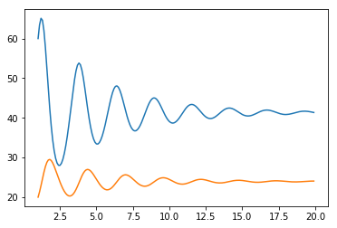

Niech x i y będą liczebnościami roślinożerców i polujących na nie drapieżników na jakimś zamkniętym obszarze. Prędkości zmian obu populacji dane są równaniami Lotki-Volterry:

dx/dt = rx x

dy/dt = ry y,

gdzie rx to rozrodczość populacji roślinożerców dana wzorem rx = a - b x - c y - na sukces rozrodczy ujemnie wpływa liczebność własnej populacji (konkurencja o kryjówki, miejsca rozrodu itp) jak i liczebność drapieżników. Z kolei rozrodczość drapieżników dana jest wzorem ry = -d +ex-fy - wpływa na nią pozytywnie liczbność potencjalnych ofiar, a negatywnie zagęszczenie własnej populacji.
    
    Zasymuluj dynamikę układu dwóch gatunków dla a=5, b=0.005, c=0.2, d=1, e=0.03, f=0.01 [1/rok] w pierwszych 10 latach oddziaływania populacji. W chwili początkowej liczebności gatunków wynoszą x0 = 60, y0 = 20. Narysuj przebiegi czasowe liczebności obu populacji na jednym wykresie.


```python
import matplotlib.pyplot as plt
import numpy as np
from scipy.integrate import odeint
```


```python
# Rozwiązanie

"""
->     | x |   | rx y |
p(t) = |   | = |      |
       | y |   | ry y |

return [rx*x, ry*y]
"""


def pole(X,t):
    x,y=X
    a,b,c,d,e,f=5,0.005,0.2,1,0.03,0.01
    return [(a-b*x-c*y)*x, (-d+e*x-f*y)*y]

t = np.arange(1,20,0.1)

rozw = odeint(pole,[60,20],t)

plt.plot(t,rozw)
plt.show()
```




